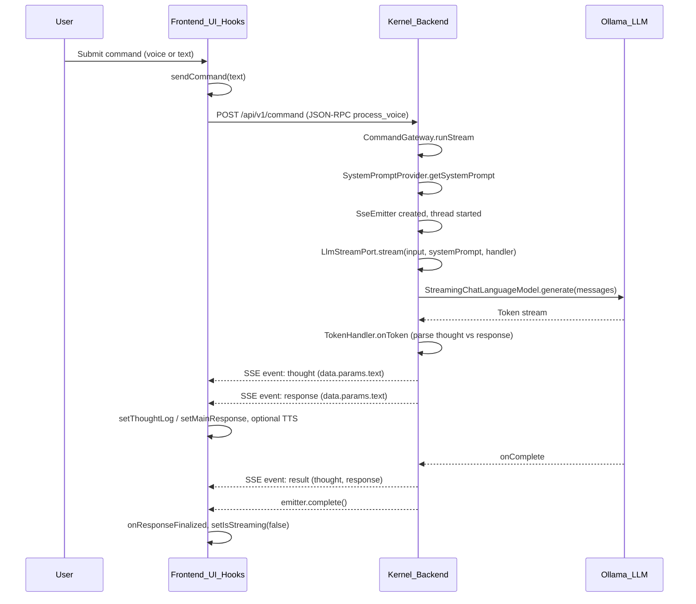
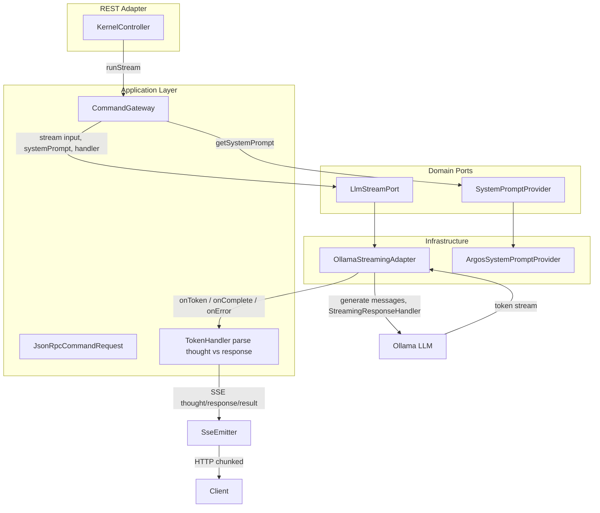
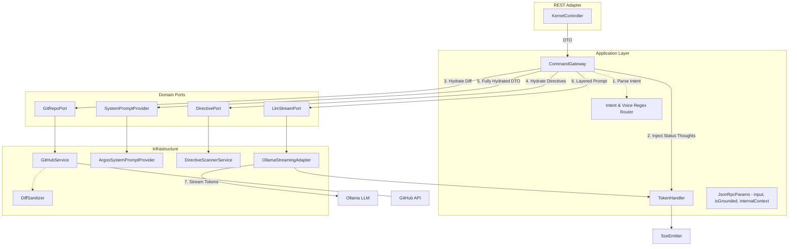

# ARGOS-1 diagrams

High-level process and backend architecture in Mermaid.

---

## High-level: frontend–backend interaction (one command, SSE stream)

- Frontend POSTs JSON-RPC to `/api/v1/command` and consumes SSE; backend parses `<thought>` and response, streams events to the client.

---

## Backend architecture and data flow (command stream to Ollama and SSE)

- CommandGateway orchestrates LlmStreamPort and SystemPromptProvider; OllamaStreamingAdapter calls Ollama via LangChain4j.

## Agentic AI Architecture

